# Authority Relationship Diagram

**Status:** Architecture Artifact (Phase 01)  
**Authority:** PHASE-01 §7 / §15 (Deliverable 2)

```mermaid
flowchart TD
    subgraph L2["Layer 2 — Decision"]
        DIE["Decision Intelligence Authority"]
    end

    subgraph L3["Layer 3 — Institutional Authority"]
        Config["Configuration Authority"]
        HW["Hardware Authority"]
        Mining["Mining Authority"]
        Profit["Profitability Authority"]
        Power["Power Authority"]
        Thermal["Thermal Authority"]
        Health["Health Authority"]
        Sched["Scheduler Authority"]
        Telemetry["Telemetry Authority"]
        DB["Database Authority"]
        Security["Security Authority"]
        Workload["Workload Authority"]
        Notify["Notification Authority"]
        Earnings["Earnings Authority"]
        Policy["Policy Authority"]
    end

    subgraph L4["Layer 4 — Capability"]
        CapReg["Capability Registry Authority"]
        PlugReg["Plugin Registry Authority"]
    end

    subgraph LAI["Decision Augmentation"]
        ML["Machine Learning Authority (future)"]
    end

    EB(["Event Bus"])

    DIE <-. events/interfaces .-> EB
    Config <-. events/interfaces .-> EB
    HW <-. events/interfaces .-> EB
    Mining <-. events/interfaces .-> EB
    Profit <-. events/interfaces .-> EB
    Power <-. events/interfaces .-> EB
    Thermal <-. events/interfaces .-> EB
    Health <-. events/interfaces .-> EB
    Sched <-. events/interfaces .-> EB
    Telemetry <-. events/interfaces .-> EB
    DB <-. events/interfaces .-> EB
    Security <-. events/interfaces .-> EB
    Workload <-. events/interfaces .-> EB
    Notify <-. events/interfaces .-> EB
    Earnings <-. events/interfaces .-> EB
    Policy <-. events/interfaces .-> EB
    CapReg <-. events/interfaces .-> EB
    PlugReg <-. events/interfaces .-> EB
    ML -. predictions/confidence only .-> DIE
```

## Rules

- Every authority reaches every other authority only through the Event Bus, interfaces, or approved authority contracts — never a direct call.
- No circular dependencies. No shared mutable state.
- The Machine Learning Authority (future) is one-directional into the Decision Intelligence Authority: predictions, rankings, forecasts, confidence scores only. It never receives control back.
- Policy Authority is consulted by the Decision Pipeline's Policy Evaluation stage, not called directly by other authorities.

See `RUNTIME_ARCHITECTURE.md` §5 and `AUTHORITY_REGISTRY.md`.
