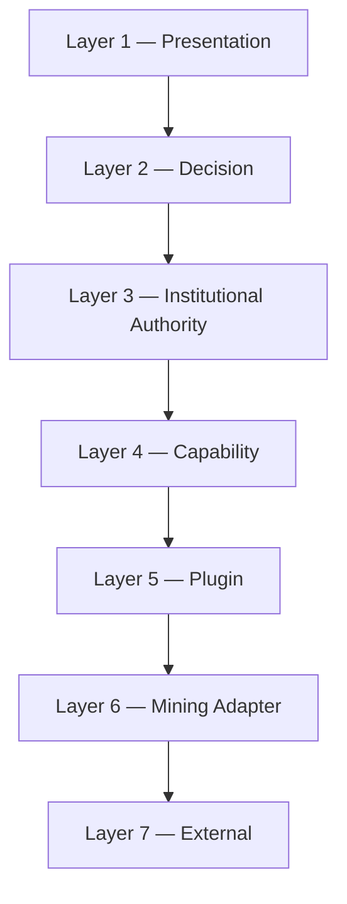

# Dependency Graph

**Status:** Architecture Artifact (Phase 01)  
**Authority:** PHASE-01 §8 / §15 (Deliverable 5)

## Allowed Dependencies

- Each layer depends only on the layer(s) directly below it, through approved interfaces.
- Authorities within Layer 3 depend on each other only through the Event Bus or approved authority contracts — never a direct call, never Layer 3 → Layer 3 skip-graph edges outside those channels.
- No layer or authority may depend "upward" (e.g., Plugin Layer depending on Institutional Authority Layer).

## Prohibited

- Circular dependencies of any kind.
- Shared mutable state between authorities or layers.
- Direct plugin interaction by an authority (must go through Plugin Registry Authority / Mining Adapter Layer).
- Skipping a layer (e.g., Presentation calling an Institutional Authority directly, bypassing the Decision Layer).

This graph has zero cycles by construction — it is enforced by the Dependency Laws in `RUNTIME_ARCHITECTURE.md` §5, not merely diagrammed.
