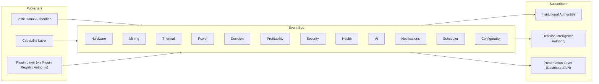

# Event Flow Diagram

**Status:** Architecture Artifact (Phase 01)  
**Authority:** PHASE-01 §10 / §15 (Deliverable 4)

## Rules

1. Every authority publishes events; no authority calls another authority directly.
2. Every authority subscribes only to the event categories it is approved to consume.
3. No direct event coupling — publishers do not know their subscribers.
4. Minimum event categories: Hardware, Mining, Thermal, Power, Decision, Profitability, Security, Health, AI, Notifications, Scheduler, Configuration.

## Phase 01 Note

No Event Bus implementation exists yet. This diagram fixes the category model and publish/subscribe rule for future implementation.
