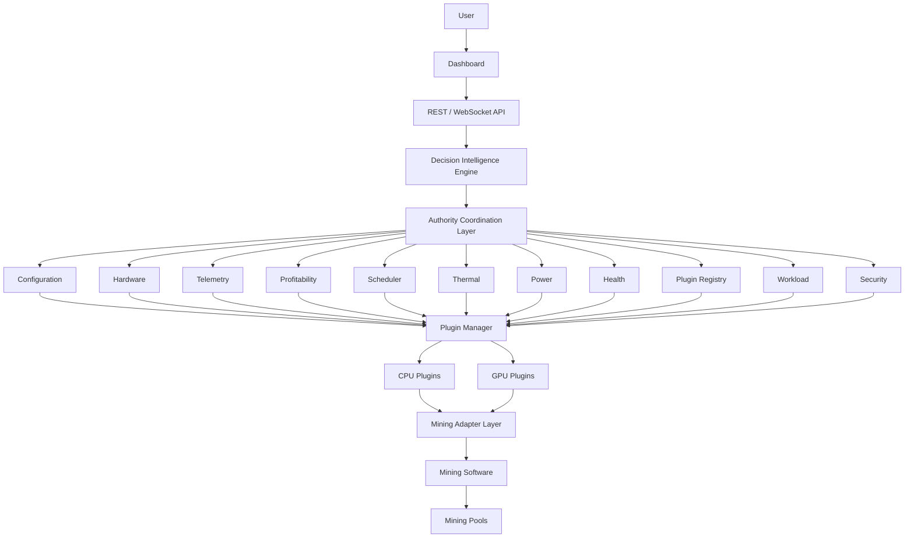

# Runtime Topology Diagram

**Status:** Architecture Artifact (Phase 01)  
**Authority:** PHASE-01 §4 / §15 (Deliverable 3)

## Rule

No authority may bypass this runtime. Every path from `User` to `Mining Pools` flows through the Decision Intelligence Engine and the Authority Coordination Layer.

See `specs/PHASE-01-institutional-system-architecture-runtime-blueprint.md` §4.
