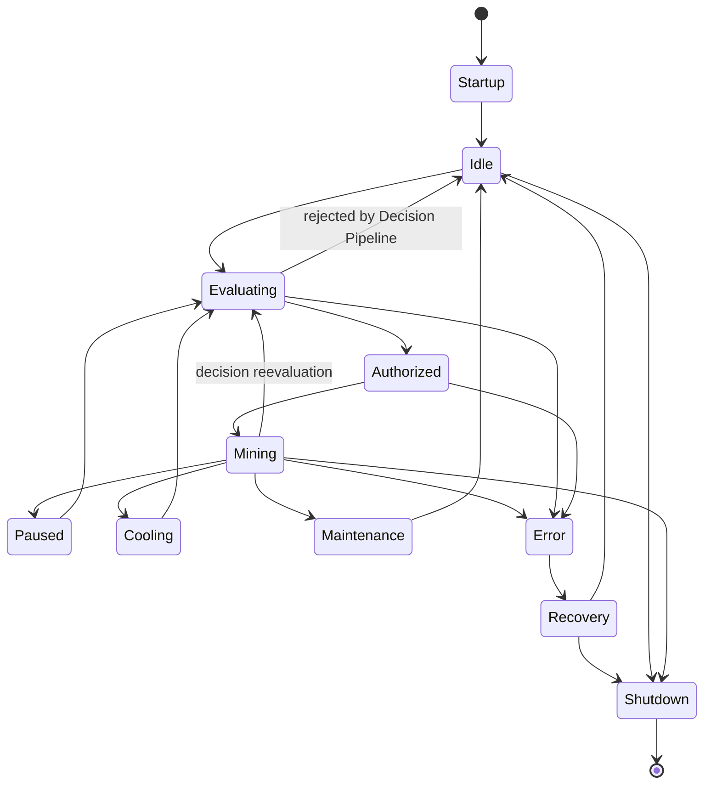

# Runtime State Machine

**Status:** Architecture Artifact (Phase 01)  
**Authority:** PHASE-01 §13 / §15 (Deliverable 6)

## State Definitions

| State | Meaning |
|-------|---------|
| Startup | System boot through Decision Engine Ready (see runtime lifecycle) |
| Idle | No active mining evaluation in progress |
| Evaluating | Decision Pipeline is running |
| Authorized | Decision Pipeline completed; mining authorized, not yet started |
| Mining | Mining Authority has started mining via the Mining Adapter Layer |
| Paused | Mining temporarily suspended by policy, schedule, or manual override |
| Cooling | Mining suspended by Thermal Authority pending safe temperature |
| Maintenance | Platform or plugin maintenance in progress |
| Shutdown | Graceful shutdown in progress |
| Recovery | Recovering from an Error state |
| Error | An unrecoverable fault occurred in the pipeline or runtime |

Transitions not shown are prohibited. Every transition shall be logged to the Explainability Pipeline where it results from a decision.
