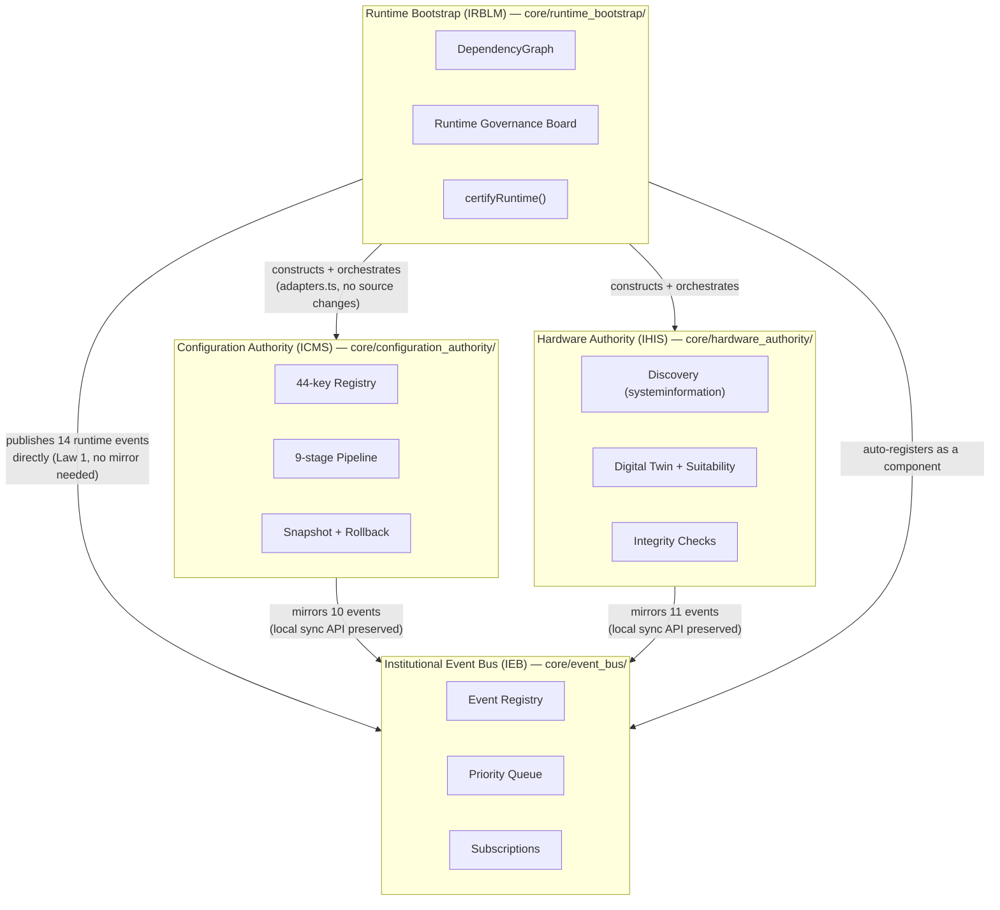
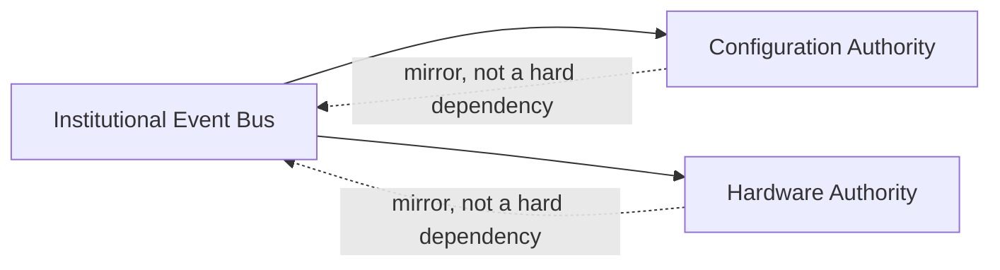

# Program I — As-Built Architecture

The Phase 01 diagrams (`architecture/diagrams/`) describe the platform's full eventual shape. This document is different: it shows **what actually exists and runs today**, grounded in real code, not aspiration.

## System Diagram (as implemented)

## Layer Mapping to Phase 01's Runtime Architecture

| Phase 01 Layer | Real component today |
|---|---|
| Layer 1 — Presentation | Not implemented (`dashboard/`, `api/` are empty scaffolding) |
| Layer 2 — Decision | Not implemented (no Decision Intelligence Authority) |
| Layer 3 — Institutional Authority | Configuration Authority (ICMS), Hardware Authority (IHIS) — 2 of 19 |
| Layer 4 — Capability | Capability Registry reserved (ADR-0002); IHIS exposes a read-surface for it |
| Layer 5 — Plugin | Not implemented (no plugin has been built; `plugins/cpu/monero`, `plugins/gpu/flux` are empty reserved slots) |
| Layer 6 — Mining Adapter | Not implemented |
| Layer 7 — External | Not implemented |
| *(infrastructure, not a layer)* | Institutional Event Bus (IEB) — the transport every layer will use |
| *(infrastructure, not a layer)* | Runtime Bootstrap (IRBLM) — assembles and supervises everything above |

## Dependency Direction (enforced, not just diagrammed)

This is `DependencyGraph.startupOrder()`'s actual resolved order when both authorities are registered with IRBLM: Event Bus first (no dependencies), then Configuration Authority and Hardware Authority (each depends on the bus, order between them is otherwise unconstrained — both declare `dependencies: ['Institutional Event Bus']` and nothing else).

## What's Explicitly Not Drawn Here

Capability Registry, Plugin Registry, Policy Authority, Decision Intelligence, Mining, Scheduler, Power, Thermal, Health, Telemetry, Database, Security, Workload, Notification, Earnings, and Machine Learning Authorities all appear in Phase 01's runtime topology but have no code. Drawing them into this diagram would misrepresent the platform's actual current state — see `authority-registry.md` for the complete status of all 19.
