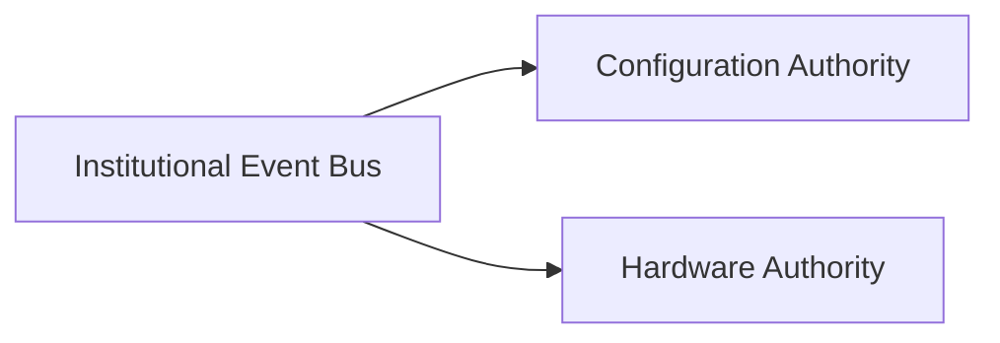

# Program I — Runtime Dependency Graph

The actual graph `DependencyGraph.startupOrder()` resolves when Configuration Authority and Hardware Authority are both registered with a `RuntimeOrchestrator` (`core/runtime_bootstrap/src/adapters.ts`).

## Declared Dependencies

| Component | Declares `dependencies:` | Why |
|---|---|---|
| Institutional Event Bus | `[]` | Foundational transport; nothing else must exist first |
| Configuration Authority | `['Institutional Event Bus']` | So the bus can be threaded into its constructor for mirroring (ADR-0009 §6) |
| Hardware Authority | `['Institutional Event Bus']` | Same reason |

## Resolved Startup Order

Kahn's-algorithm topological sort (`dependencyGraph.ts`) — deterministic, stable-tie-broken by registration order. The Event Bus is always first (in-degree 0); Configuration Authority and Hardware Authority both become ready the instant the bus initializes, and are ordered relative to each other only by registration order (whichever was `registerComponent()`-ed first).

## Shutdown Order

Exact reverse: whichever of Configuration/Hardware Authority started last shuts down first; the Event Bus shuts down last, since everything else may still be mirroring events to it during their own teardown.

## Cycle and Missing-Dependency Detection

Both are real, tested mechanisms (`tests/dependencyGraph.test.ts`), not just documented rules:

- `MissingDependencyError` — thrown before any component is created, if a declared dependency name isn't registered.
- `CircularDependencyError` — thrown if the topological sort can't fully order the graph (direct A→B→A and indirect A→B→C→A cycles both caught).

## What Grows This Graph Later

Registering Capability Registry, Plugin Registry, Policy Authority, or any of the 15 not-yet-started domain authorities is a `registerComponent()` call with a `ComponentDefinition` declaring its real dependencies (e.g., a future Mining Authority would plausibly declare `dependencies: ['Configuration Authority', 'Hardware Authority', 'Institutional Event Bus']`). No change to `DependencyGraph`, `RuntimeOrchestrator`, or this document's mechanism is required — only new nodes and edges.
