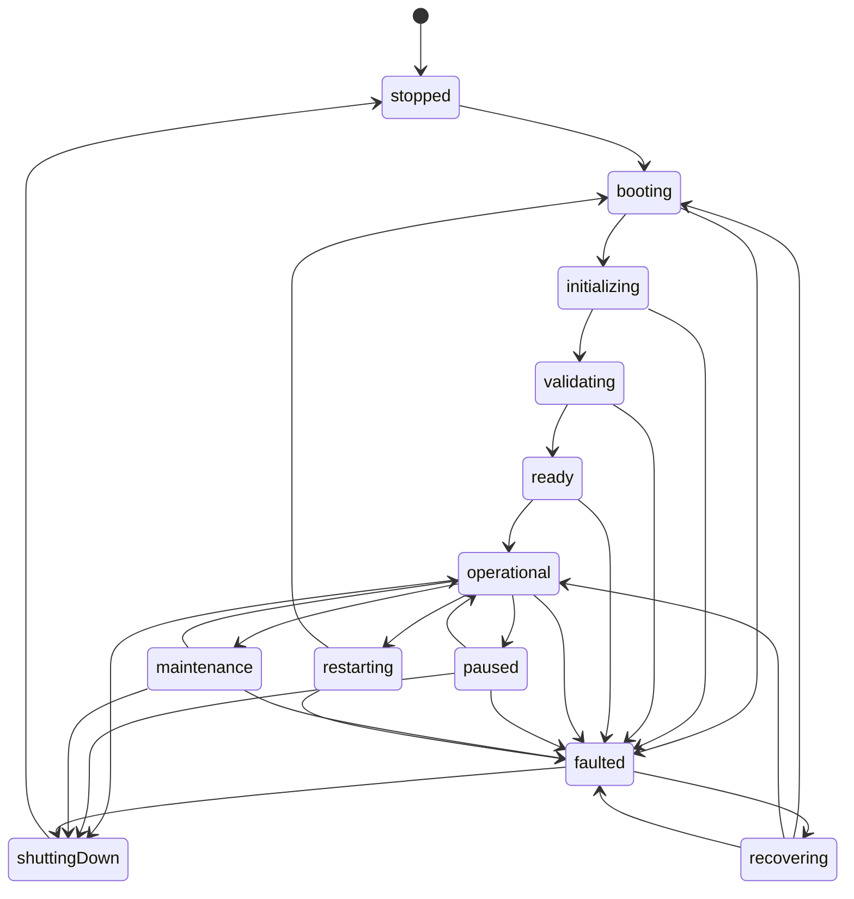

# Program I — Runtime Lifecycle

Source of truth: `core/runtime_bootstrap/src/lifecycleStateMachine.ts`, `RuntimeOrchestrator.ts`.

## The 12 States

(State names shown as identifiers `shuttingDown` for diagram compatibility — the actual `RuntimeState` string value in code is `'shutting-down'`, per `types.ts`.)

## Boot Sequence

1. `stopped` → `booting` — `BootstrapStarted` published
2. `booting` → `initializing` — `InitializationStarted` published
3. Dependency graph resolved (`DependencyGraph.startupOrder()`); a missing/circular dependency fails the boot before any component is touched
4. Each component: `create()` → `initialize()`, in dependency order. A dependency that failed to *initialize* (not just "wasn't created") blocks everything depending on it
5. `InitializationCompleted` published. **Strict mode** (default): any failure here faults the whole platform. `allowPartialStartup: true`: failures are recorded but don't block the rest
6. `initializing` → `validating` — a **separate** readiness-verification pass runs `checkReadiness()`/`checkHealth()` for every successfully-initialized component; `ReadinessVerified` published
7. `certifyRuntime()` runs over the ready pool — blocks only on `faulted` health, never `degraded`
8. On success: `RuntimeCertified` → `validating` → `ready` → `operational` → `RuntimeOperational` → `BootstrapCompleted`. On failure: `faulted` → `RuntimeFaulted`, and `boot()` throws (`BootstrapFailedError` or `CertificationFailedError`)

## Shutdown Sequence

`requestShutdown()`: `operational` → `shutting-down` (`ShutdownRequested`) → every component's `shutdown()` called in **reverse** dependency order, one component's failure never blocking the rest (best-effort, all failures reported) → `stopped` (`ShutdownCompleted`).

## Restart

- **Full platform** (`requestRestart()`, no name): tear down every component in reverse order (best-effort), clear instances, re-run the entire boot sequence. Restart counts increment on the Governance Board; audit/operation history is preserved, never cleared.
- **Single component** (`requestRestart(name)`): shuts down and rebuilds just that component. **Does not cascade to dependents** — a documented scope simplification (ADR-0010 §6), not silently assumed.

## Recovery (distinct from restart)

`recover()` re-validates currently-held instances **without** tearing them down or recreating them — only legal from `faulted`. If re-checked readiness/health now pass certification, transitions straight to `operational` (`RuntimeRecovered`, `recoveryCount` increments). If not, stays `faulted` (`RuntimeFaulted` published again).

## Pause / Resume / Maintenance

`pause(reason?)` / `resume()` toggle `operational` ↔ `paused`, publishing `RuntimePaused`/`RuntimeResumed` with the reason in the payload. `requestMaintenance()` moves to `maintenance`; `resume()` also exits it back to `operational`. Neither has a dedicated bus event beyond what's listed above — both are still recorded in `getRuntimeHistory()`.
